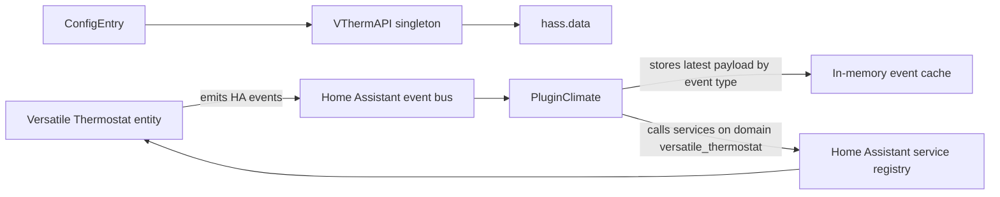
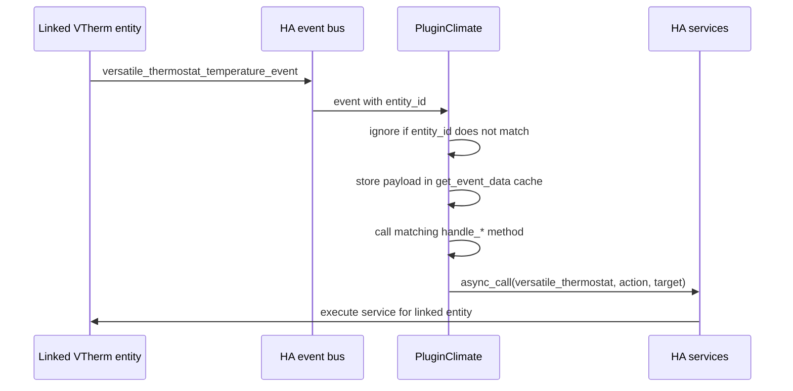

# vtherm_api

Developer-facing API for integrating with Versatile Thermostat inside Home Assistant.

This package currently exposes two main building blocks:

- `VThermAPI`: a singleton stored in `hass.data` that lets an integration register config entries, access the Home Assistant runtime, and link a plugin climate to an existing Versatile Thermostat entity.
- `PluginClimate`: an event-driven helper that subscribes to Versatile Thermostat events for one linked thermostat and forwards service calls back to that thermostat.

The package is designed for Home Assistant integration code, not as a standalone HTTP or REST API.

## Table of contents

- [What this package solves](#what-this-package-solves)
- [Requirements](#requirements)
- [Installation for development](#installation-for-development)
- [Architecture](#architecture)
- [Public imports](#public-imports)
- [Using VThermAPI](#using-vthermapi)
- [Using PluginClimate](#using-pluginclimate)
- [Supported VTherm events](#supported-vtherm-events)
- [Practical patterns](#practical-patterns)
- [Testing your integration](#testing-your-integration)

## What this package solves

When you build custom Home Assistant code around Versatile Thermostat, you usually need to:

1. Keep a stable reference to the integration runtime.
2. Track one specific VTherm climate entity.
3. Listen only to that thermostat's events.
4. Relay actions such as HVAC mode or target temperature changes back to the linked thermostat.

This package provides those responsibilities out of the box.

## Requirements

- Python 3.14+
- Home Assistant runtime objects such as `HomeAssistant`, `ConfigEntry`, `Event`, and the service bus
- A Versatile Thermostat entity already registered in Home Assistant

For local development, the repository uses Home Assistant `2026.3.1`.

## Installation for development

Install the local development dependencies:

```bash
python -m pip install --upgrade pip
python -m pip install -r requirements-dev.txt
python -m pip install -e .
```

Run the test suite:

```bash
pytest
```

## Architecture





## Public imports

The package root exports `PluginClimate` and `__version__`.

Use these imports in integration code:

```python
from vtherm_api import PluginClimate
from vtherm_api.const import DOMAIN, EventType
from vtherm_api.vtherm_api import VThermAPI
```

## Using VThermAPI

`VThermAPI` is a singleton attached to the Home Assistant runtime through `hass.data[DOMAIN][VTHERM_API_NAME]`.

### Main responsibilities

- attach the API instance to a `HomeAssistant` object
- register and remove `ConfigEntry` instances
- expose the active `HomeAssistant` object through `api.hass`
- expose a timezone-aware `api.now`
- optionally link a plugin climate entity to a VTherm climate entity

### Create or retrieve the singleton

```python
from homeassistant.config_entries import ConfigEntry
from homeassistant.core import HomeAssistant

from vtherm_api.vtherm_api import VThermAPI


async def async_setup_entry(hass: HomeAssistant, entry: ConfigEntry) -> bool:
    api = VThermAPI.get_vtherm_api(hass)
    api.add_entry(entry)

    print(api.name)  # VThermAPI
    print(api.hass is hass)  # True
    print(api.now)  # timezone-aware datetime from HA
    return True


async def async_unload_entry(hass: HomeAssistant, entry: ConfigEntry) -> bool:
    api = VThermAPI.get_vtherm_api()
    if api is not None:
        api.remove_entry(entry)
    return True
```

### Reset the singleton

This is mainly useful in tests:

```python
from vtherm_api.vtherm_api import VThermAPI


def teardown_function() -> None:
    VThermAPI.reset_vtherm_api()
```

### Link a plugin climate through the API helper

`VThermAPI.link_to_vtherm(vtherm, plugin_vtherm_entity_id)` searches registered climate entities and links the matching plugin entity to the provided VTherm object.

Use this helper only if your plugin climate is already registered as a Home Assistant climate entity and can be found in the climate component.

```python
from types import SimpleNamespace

from vtherm_api.vtherm_api import VThermAPI


async def async_bind_plugin(hass):
    api = VThermAPI.get_vtherm_api(hass)

    linked_vtherm = SimpleNamespace(entity_id="climate.living_room")
    api.link_to_vtherm(
        linked_vtherm,
        plugin_vtherm_entity_id="climate.living_room_plugin",
    )
```

If you are working with a subclass of `PluginClimate`, direct linking is usually simpler and more explicit. That pattern is shown below.

## Using PluginClimate

`PluginClimate` is an event listener and service forwarder bound to one linked thermostat.

### What happens when you link it

When you call `plugin.link_to_vtherm(vtherm)`:

1. Existing listeners are removed.
2. The new thermostat reference is stored in `plugin.linked_vtherm`.
3. One Home Assistant listener is registered for each `EventType`.

Only events whose `entity_id` matches `linked_vtherm.entity_id` are handled.

### Basic usage

```python
from types import SimpleNamespace

from homeassistant.core import HomeAssistant

from vtherm_api import PluginClimate


def create_plugin(hass: HomeAssistant) -> PluginClimate:
    plugin = PluginClimate(hass)
    plugin.link_to_vtherm(SimpleNamespace(entity_id="climate.living_room"))
    return plugin
```

### Subclass PluginClimate to react to events

The default handler methods are intentionally empty. Override the handlers you need.

```python
from typing import Any

from homeassistant.core import Event, HomeAssistant

from vtherm_api.const import EventType
from vtherm_api.plugin_climate import PluginClimate


class RecordingPluginClimate(PluginClimate):
    def __init__(self, hass: HomeAssistant) -> None:
        super().__init__(hass)
        self.temperature_updates: list[dict[str, Any]] = []
        self.mode_updates: list[dict[str, Any]] = []

    def handle_temperature_event(self, event: Event) -> None:
        payload = self.get_event_data(EventType.TEMPERATURE_EVENT)
        self.temperature_updates.append(payload)

    def handle_hvac_mode_event(self, event: Event) -> None:
        payload = self.get_event_data(EventType.HVAC_MODE_EVENT)
        self.mode_updates.append(payload)
```

Then link it explicitly:

```python
from types import SimpleNamespace


plugin = RecordingPluginClimate(hass)
plugin.link_to_vtherm(SimpleNamespace(entity_id="climate.living_room"))
```

### Simulate a VTherm event

This is useful in tests or when validating your integration wiring.

```python
from vtherm_api.const import EventType


hass.bus.async_fire(
    EventType.TEMPERATURE_EVENT.value,
    {
        "entity_id": "climate.living_room",
        "current_temperature": 20.5,
        "target_temperature": 21.0,
    },
)
```

After the event is handled:

- `plugin.last_event_type` becomes `EventType.TEMPERATURE_EVENT`
- `plugin.get_event_data(EventType.TEMPERATURE_EVENT)` returns the last payload for that event type

### Forward an action to the linked thermostat

`PluginClimate.call_linked_vtherm_action(...)` delegates a Home Assistant service call to the `versatile_thermostat` domain and automatically targets the linked thermostat entity.

```python
await plugin.call_linked_vtherm_action(
    "set_hvac_mode",
    action_data={"hvac_mode": "heat"},
)

await plugin.call_linked_vtherm_action(
    "set_target_temperature",
    action_data={"temperature": 19.5},
    blocking=True,
)

await plugin.call_linked_vtherm_action(
    "set_preset_mode",
    action_data={"preset_mode": "eco"},
    return_response=True,
)
```

Under the hood, the service call is equivalent to:

```python
await hass.services.async_call(
    DOMAIN,
    action_name,
    action_data,
    blocking,
    context,
    {"entity_id": linked_vtherm.entity_id},
    return_response,
)
```

If no thermostat is linked, the method raises `RuntimeError`.

### Remove listeners on unload

If your integration unloads a plugin climate, remove the listeners explicitly:

```python
plugin.remove_listeners()
```

## Supported VTherm events

The plugin listens to every event defined by `EventType`.

| Event type                        | Home Assistant event name                    | Handler method                 |
| --------------------------------- | -------------------------------------------- | ------------------------------ |
| `EventType.SAFETY_EVENT`          | `versatile_thermostat_safety_event`          | `handle_safety_event`          |
| `EventType.POWER_EVENT`           | `versatile_thermostat_power_event`           | `handle_power_event`           |
| `EventType.TEMPERATURE_EVENT`     | `versatile_thermostat_temperature_event`     | `handle_temperature_event`     |
| `EventType.HVAC_MODE_EVENT`       | `versatile_thermostat_hvac_mode_event`       | `handle_hvac_mode_event`       |
| `EventType.CENTRAL_BOILER_EVENT`  | `versatile_thermostat_central_boiler_event`  | `handle_central_boiler_event`  |
| `EventType.PRESET_EVENT`          | `versatile_thermostat_preset_event`          | `handle_preset_event`          |
| `EventType.WINDOW_AUTO_EVENT`     | `versatile_thermostat_window_auto_event`     | `handle_window_auto_event`     |
| `EventType.AUTO_START_STOP_EVENT` | `versatile_thermostat_auto_start_stop_event` | `handle_auto_start_stop_event` |
| `EventType.TIMED_PRESET_EVENT`    | `versatile_thermostat_timed_preset_event`    | `handle_timed_preset_event`    |
| `EventType.HEATING_FAILURE_EVENT` | `versatile_thermostat_heating_failure_event` | `handle_heating_failure_event` |

## Practical patterns

### Pattern 1: register the API in your custom integration

```python
from homeassistant.config_entries import ConfigEntry
from homeassistant.core import HomeAssistant

from vtherm_api.vtherm_api import VThermAPI


async def async_setup_entry(hass: HomeAssistant, entry: ConfigEntry) -> bool:
    VThermAPI.get_vtherm_api(hass).add_entry(entry)
    return True


async def async_unload_entry(hass: HomeAssistant, entry: ConfigEntry) -> bool:
    api = VThermAPI.get_vtherm_api()
    if api is not None:
        api.remove_entry(entry)
    return True
```

### Pattern 2: build a plugin that mirrors temperature updates

```python
from types import SimpleNamespace

from homeassistant.core import Event

from vtherm_api.const import EventType
from vtherm_api.plugin_climate import PluginClimate


class MirrorPluginClimate(PluginClimate):
    def __init__(self, hass):
        super().__init__(hass)
        self.last_target_temperature = None

    def handle_temperature_event(self, event: Event) -> None:
        payload = self.get_event_data(EventType.TEMPERATURE_EVENT)
        self.last_target_temperature = payload.get("target_temperature")


plugin = MirrorPluginClimate(hass)
plugin.link_to_vtherm(SimpleNamespace(entity_id="climate.office"))
```

### Pattern 3: expose a command through your own integration code

```python
async def async_set_eco(plugin: PluginClimate) -> None:
    await plugin.call_linked_vtherm_action(
        "set_preset_mode",
        action_data={"preset_mode": "eco"},
        blocking=True,
    )
```

## Testing your integration

The repository tests show the intended behavior clearly:

- `PluginClimate.link_to_vtherm(...)` registers one listener per event type
- unrelated thermostat events are ignored
- the last payload is stored per event type
- `call_linked_vtherm_action(...)` forwards parameters to `hass.services.async_call(...)`

Minimal async test example:

```python
from types import SimpleNamespace
from unittest.mock import AsyncMock, MagicMock

import pytest

from vtherm_api.plugin_climate import PluginClimate


@pytest.mark.asyncio
async def test_plugin_forwards_hvac_mode() -> None:
    hass = MagicMock()
    hass.services.async_call = AsyncMock(return_value="ok")

    plugin = PluginClimate(hass)
    plugin.link_to_vtherm(SimpleNamespace(entity_id="climate.salon"))

    result = await plugin.call_linked_vtherm_action(
        "set_hvac_mode",
        action_data={"hvac_mode": "heat"},
    )

    assert result == "ok"
```

## Summary

Use `VThermAPI` when you need a stable Home Assistant-scoped singleton for Versatile Thermostat integration state.

Use `PluginClimate` when you need to:

- subscribe to VTherm events for one thermostat
- keep the latest event payloads in memory
- override dedicated handlers for domain-specific behavior
- forward service calls to the linked thermostat without rebuilding the Home Assistant target payload yourself